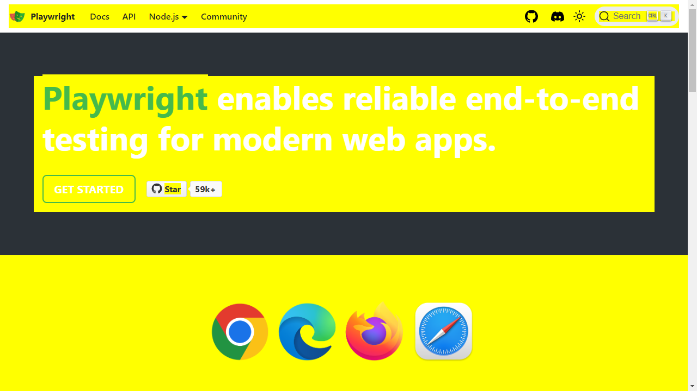

# Just a project to reproduce a bug
This is just a simple project to show that `stylePath` parameter in `toHaveScreenshot` doesn't work

## Steps to reproduce bug
1. Clone this repo
2. npm install
3. npm run test
4. Observe that the example test doesn't match the expected results because the [`stylePath` parameter in `toHaveScreenshot`](tests/example.spec.ts#L8) is ignored. If `stylePath` worked as expected, all elements in the screenshot would have a yellow background like so:

